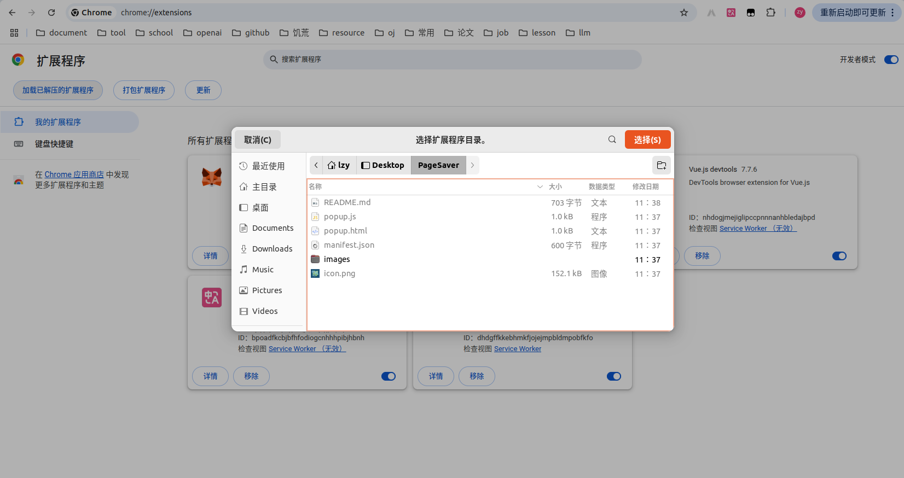
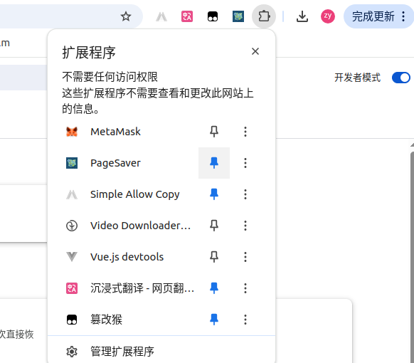
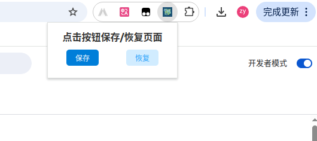

# PageSaver

> 这是一个可以保存当前打开的页面，下次直接恢复的Chrome插件。

开发这个小插件主要是为了方便开机后继续上次的工作，<a href="https://github.com/543211494/PageSaver/releases/tag/page-saver-1.0">点击此处获取.crx文件</a>

## 1.安装步骤

下载代码

```sh
git clone https://github.com/543211494/PageSaver.git
```

在谷歌浏览器中输入`chrome://extensions/`，点击加载已解压的拓展程序，选择刚拉取仓库的文件夹

也可将.crx文件拖入安装，但这种方式在windows和mac下会被chrome浏览器禁用



在右上方管理插件处固定插件



关机前点击保存，保存当前打开的页面，下次开机打开浏览器时点击恢复即可打开上次保存的页面

